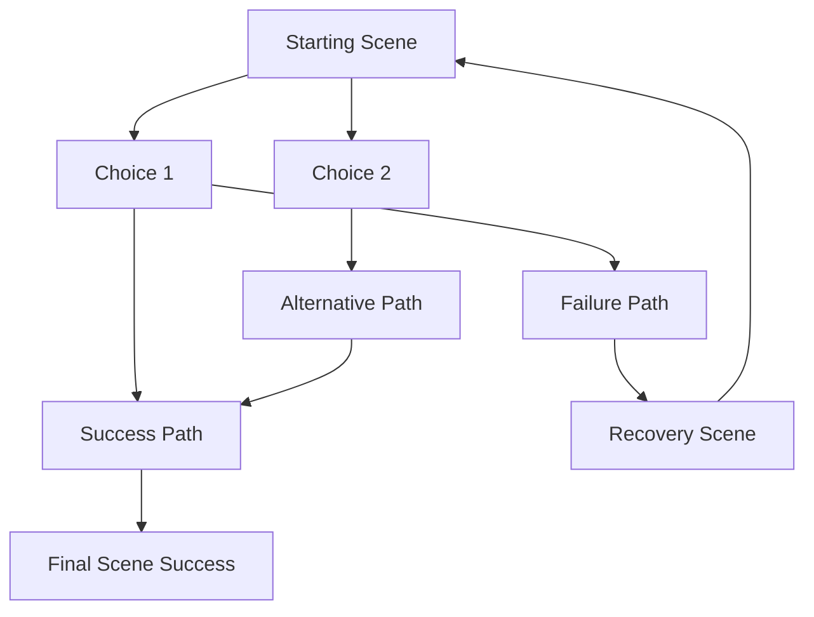

# Adventure System

This directory contains the adventure game system data files and logic. The system is designed to be modular and easily extensible.

## Directory Structure

```
adventures/
├── data/
│   ├── adventures.json       # Main adventure definitions and metadata
│   ├── items.json           # Item definitions and properties
│   ├── rewards.json         # Adventure completion rewards
│   ├── milestones.json      # Achievement and progression tracking
│   └── [adventure_name]/    # Adventure-specific scene files
│       └── scenes.json      # Scene definitions for the adventure
├── adventure_manager.py     # Core game logic
└── README.md               # This file
```

## JSON Schema Definitions

### adventures.json
```json
{
    "adventure_id": {
        "name": "string",
        "description": "string",
        "min_level": "number",
        "starting_scene": "string",
        "completion_milestone": "string",
        "reward_id": "string"
    }
}
```

### items.json
```json
{
    "item_name": {
        "type": "string",         // tool, consumable, resource, equipment, key, quest_item
        "description": "string",
        "value": "number",
        "usable": "boolean",
        "consumable": "boolean",
        "effect": {              // Optional
            "type": "string",    // heal, damage, protection
            "amount": "number",   // For heal/damage effects
            "against": "string"   // For protection effects
        }
    }
}
```

### rewards.json
```json
{
    "reward_id": {
        "gold": "number",
        "items": ["string"],     // List of item names
        "experience": "number"
    }
}
```

### milestones.json
```json
{
    "milestone_id": {
        "title": "string",
        "description": "string",
        "experience_bonus": "number",
        "unlocks": ["string"]    // List of adventure_ids or special content
    }
}
```

### [adventure_name]/scenes.json
```json
{
    "scene_id": {
        "description": "string",
        "choices": {
            "choice_number": {
                "text": "string",
                "requires_item": "string",           // Optional
                "success_rate": "number",            // Optional, 0-1
                "success": "string or object",       // Scene ID or effect object
                "failure": "string or object",       // Scene ID or effect object
                "leads_to": "string",                // Scene ID
                "loot": ["string"],                  // Optional, list of items
                "reveals": "string",                 // Optional, revelation text
                "damage": "number",                  // Optional
                "heal": "number",                    // Optional
                "bonus_xp": "number"                 // Optional
            }
        },
        "final_scene": "boolean",                   // Optional
        "success": "boolean"                        // Required for final scenes
    }
}
```

## Effect Objects
When a choice success/failure leads to an effect object, it has this structure:
```json
{
    "text": "string",            // Description of what happened
    "damage": "number",          // Optional
    "heal": "number",            // Optional
    "bonus_xp": "number",        // Optional
    "loot": ["string"],          // Optional
    "leads_to": "string"         // Required, next scene ID
}
```

## Adding New Content

1. To add a new adventure:
   - Create a new entry in `adventures.json` following the schema
   - Create a new directory under `data/` with the adventure name
   - Add a `scenes.json` file in the new directory following the schema
   - Add corresponding rewards in `rewards.json`
   - Add completion milestone in `milestones.json`

2. To add new items:
   - Add item definitions to `items.json` following the schema
   - Update relevant scenes to include the new items

3. To modify progression:
   - Update milestone requirements in `milestones.json`
   - Adjust adventure level requirements in `adventures.json`

## Example Scene Flow

Here's an example of how scenes connect in a typical adventure:



## Best Practices

1. Scene Design:
   - Always provide multiple paths to success
   - Balance risk vs reward in choices
   - Include interesting item interactions
   - Add revelations that enhance the story
   - Ensure all paths eventually lead to an ending

2. Item Usage:
   - Make required items obtainable within the adventure
   - Balance consumable items carefully
   - Use items to create interesting choices
   - Don't make items required unless alternative paths exist

3. Difficulty Balance:
   - Higher success rates for early adventures
   - Increase challenge gradually
   - More damage in higher level adventures
   - Better rewards for harder challenges
   - Multiple checkpoints in longer adventures 